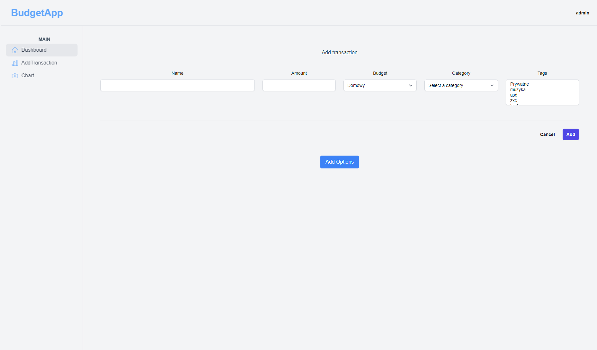
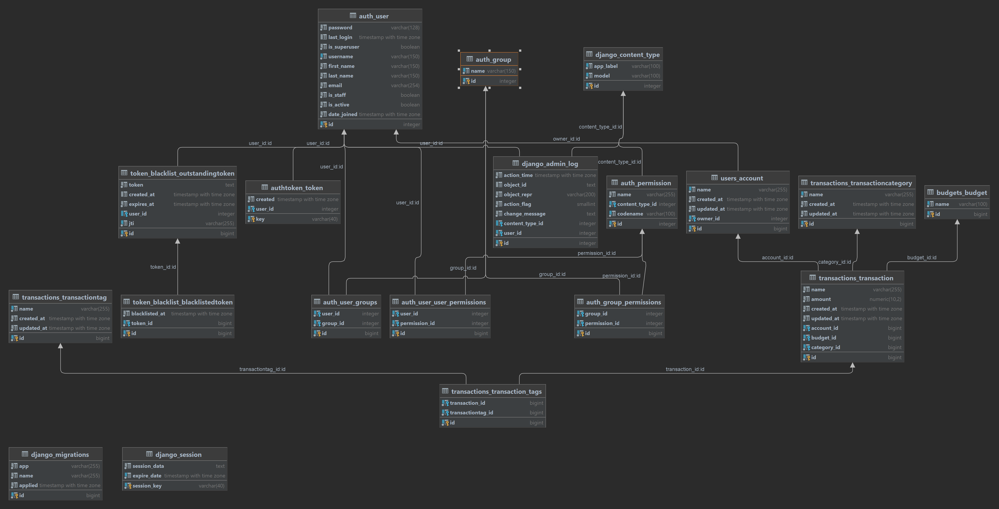

# BudgetApp

BudgetApp to aplikacja do zarządzania budżetem, która umożliwia śledzenie transakcji i kategorii związanych z budżetem domowym, firmowym itp.

## Funkcje

- Dodawanie i edycja transakcji związanych z budżetem
- Tworzenie i zarządzanie kategoriami transakcji
- Generowanie statystyk dotyczących budżetu
- Podział budżetu na różne typy (np. domowy, firmowy)

## Wymagania

Aby uruchomić aplikację BudgetApp, musisz mieć zainstalowane następujące oprogramowanie:

- Python 3.x
- Django 3.x
- Node.js 18.X
- Docker(docker-compose)

### Prerequisites

- Docker: [Install Docker](https://docs.docker.com/get-docker/)
- Docker Compose: [Install Docker Compose](https://docs.docker.com/compose/install/)

## Wygląd
Logowanie:


Rejestracja:


Strona główna:


Dodawnaie wydatków:


Dodawnaie wydatków:


ERD:


### Instalacja

1. Sklonuj repozytorium:

`git clone https://github.com/mredisax/BudgetApp.git.git`

2. Przejdź do katalogu projektu:

`cd BudgetApp`

3. Zbudowanie obrazów i uruchomienie aplikacji
```
docker-compose up --build
```

Aplikcajca frontendowa domyślnie nasłuchuje na porcie 8080 a backendowa 8080

